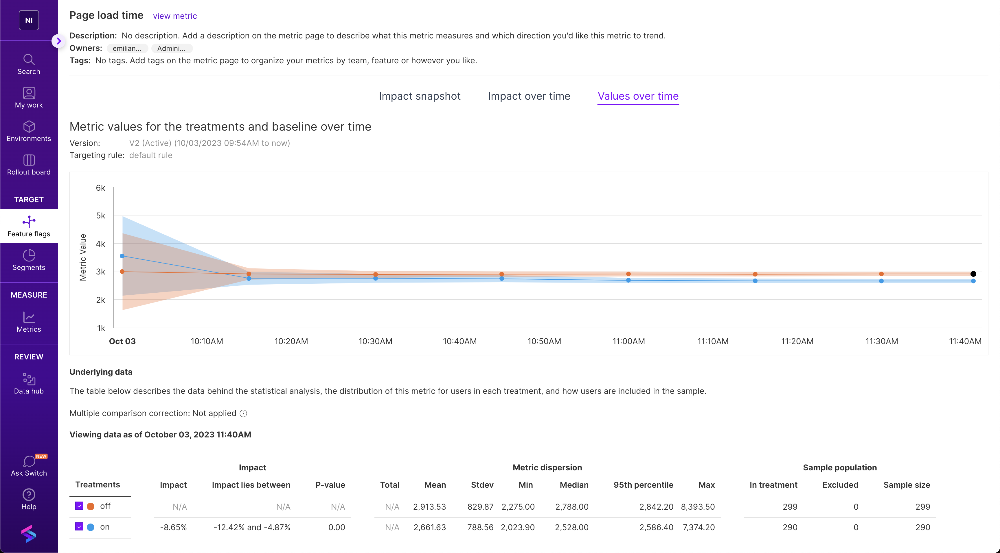

The example consists of an A/B test comparing the performance of two variants of a web page. A NodeJS server serves these variants behind a feature flag using Split's NodeJS SDK. The web pages are built with Webpack and utilize the Split's RUM Agent to capture performance metrics such as page load time and Web-vitals.

One of the variants (treatment 'on') includes performance optimizations, while the other (treatment 'off') doesn't. For example, the 'on' variant loads the RUM agent using dynamic imports and is built with Webpack's "production" mode, which minifies the code. In contrast, the 'off' variant loads the RUM Agent synchronously, blocking the page load, and is built with Webpack's "development" mode that doesn't minifies the code by default.

An automation script navigates the page multiple times, generating events and impressions for both treatments.

# How to run

This example assumes you have set up a feature flag in an environment, with traffic type 'user' and two treatments: 'on' and 'off'.

1. Take a copy of `.env.example` and re-name to `.env`.
2. Add your Split SDK keys and feature flag name to `.env`.
3. Run `npm install` to install dependencies.
4. Run `npm run serve` to build the app and start the server. The Web page will be served at `http://localhost:3000/?id=<user-id>`, where `<user-id>` is a unique identifier for the user, used by the Split SDK to bucket the user into a treatment.
5. Run `npm run automation` to run the automation script. The script can take a few minutes to complete, as it will generate events and impressions by navigating to the Web page multiple times with different user IDs, using [Puppeteer and Chrome Headless](https://www.npmjs.com/package/puppeteer).
6. Open the Split UI, create metrics associated to the events captured by the RUM Agent, and analyze the results. For example, in the Create Metric panel, you can create a metric for page load time, by selecting traffic type `user`, event type `page.load.time`, desired impact "Decrease", and measured as "Average of event values per user". See more about ["Creating a Metric"](https://help.split.io/hc/en-us/articles/360020586132-Creating-a-metric) and ["Metrics impact tab"](https://help.split.io/hc/en-us/articles/360020844451-Metrics-impact-tab).

# Contents

- `/client`: source code of the Web application and its two variants.
  - `/client/index-on.js`: entry point for the optimized variant, served for treatment `on`.
  - `/client/index-off.js`: entry point for the default variant, served for treatment `off`.
- `/webpack.config.js`: Webpack configuration to build the two variants of the application.
- `/dist`: built static assets of the application, generated by Webpack.
- `/server/index.js`: source code of the NodeJS server that implements the endpoint `GET /?id=<user-id>` that serves the two variants of the application behind a feature flag.
- `/automation.js`: automation script to run Puppeteer, navigate to the application and generate events and impressions.

# Script

- `npm run dev`: starts Webpack with watch flag and NodeJS server with Nodemon, so that the application is rebuilt and the server restarted on file changes in the `/client` and `/server` folders respectively, for development purposes.
- `npm run build`: builds the two variants of the application.
- `npm run serve`: builds the two variants of the application and starts the NodeJS server.
- `npm run automation`: runs the automation script.
